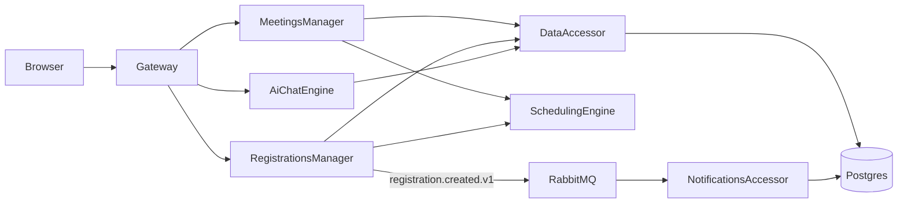

# MeetingFlow.Microservices

ASP.NET Core minimal-API microservices following the **IDesign method** (Manager / Engine / Resource Accessor), running on Docker Compose with Postgres and RabbitMQ.

## Architecture

```
MeetingFlow.Microservices/
├── docker-compose.yml
├── infra/postgres/init.sql
│
├── src/
│   ├── Contracts/                              # Service-owned transport contracts
│   │   ├── DataAccessor.Contracts/
│   │   ├── SchedulingEngine.Contracts/
│   │   ├── NotificationsAccessor.Contracts/
│   │   ├── MeetingsManager.Contracts/
│   │   ├── RegistrationsManager.Contracts/
│   │   ├── AiChatEngine.Contracts/
│   │   └── MeetingFlow.IntegrationEvents/      # Versioned RabbitMQ events
│   │
│   ├── Gateway/
│   │   ├── Contracts/                          # Public API models
│   │   ├── Mappings/                           # Downstream → public mapping
│   │   └── Clients/                            # Typed Manager/Engine clients
│   │
│   ├── Managers/
│   │   ├── MeetingsManager/
│   │   │   ├── Clients/
│   │   │   └── Mappings/
│   │   └── RegistrationsManager/
│   │       ├── Clients/
│   │       ├── Mappings/
│   │       ├── Pricing/
│   │       └── Messaging/
│   │
│   ├── Engines/
│   │   ├── SchedulingEngine/                   # Narrow stateless contracts
│   │   └── AiChatEngine/
│   │
│   ├── Accessors/
│   │   ├── DataAccessor/
│   │   │   ├── Models/                         # EF entities; never cross HTTP
│   │   │   ├── Mappings/
│   │   │   └── Repositories/
│   │   └── NotificationsAccessor/
│   │
│   └── Web/
```

### IDesign Roles

| Role                  | Service               | Responsibility                                                         |
| --------------------- | --------------------- | ---------------------------------------------------------------------- |
| **Client**            | Gateway               | Public HTTP edge — routes to Managers                                  |
| **Manager**           | MeetingsManager       | Meeting/session/speaker orchestration                                  |
| **Manager**           | RegistrationsManager  | Registration + feedback orchestration, pricing                         |
| **Engine**            | SchedulingEngine      | Pure logic — conflict detection, capacity checks                       |
| **Engine**            | AiChatEngine          | AI chat with action execution                                          |
| **Resource Accessor** | DataAccessor          | EF Core CRUD over Postgres (meetings, registrations, feedback schemas) |
| **Resource Accessor** | NotificationsAccessor | Notification persistence + fake email sending                          |

### Tech Stack

- **ASP.NET Core 10** — Minimal APIs in each service
- **EF Core** — Npgsql (Postgres) provider
- **PostgreSQL 16** — shared instance with 4 schemas
- **RabbitMQ** — async event publishing (registration.created)
- **Docker Compose** — container orchestration
- **Microsoft.Extensions.AI** — AI chat abstraction (OpenAI / rule-based fallback)

## Service Communication



Synchronous integrations use typed `HttpClient`s and service-owned contract
packages. Registration notifications are asynchronous only:
`RegistrationsManager` publishes `registration.created.v1`, and
`NotificationsAccessor` consumes it from RabbitMQ.

### Contract boundaries

- EF Core entities exist only inside their owning Accessor.
- Each HTTP provider owns a small contract project consumed by its callers.
- Managers map downstream DTOs into use-case DTOs.
- Gateway maps Manager/Engine DTOs into separate public API models.
- Public write models contain only client-controlled fields.
- RabbitMQ events are versioned independently from HTTP contracts.

## Database Schemas

The shared Postgres instance has 4 schemas created by `infra/postgres/init.sql`:

| Schema          | Owner Service         | Tables                               |
| --------------- | --------------------- | ------------------------------------ |
| `meetings`      | DataAccessor          | Meetings, Sessions, Speakers, Venues |
| `registrations` | DataAccessor          | Registrations, Attendees             |
| `feedback`      | DataAccessor          | Feedback                             |
| `notifications` | NotificationsAccessor | Notifications                        |

Tables are created by EF Core `EnsureCreated()` at service startup. Seed data is loaded automatically.

## Public REST Endpoints (Gateway, port 8080)

| Method | Path                                    | Description                                      |
| ------ | --------------------------------------- | ------------------------------------------------ |
| POST   | `/venues`                               | Create a venue                                   |
| DELETE | `/venues/{id}`                          | Delete an unused venue                           |
| GET    | `/meetings`                             | Public meeting summaries                         |
| GET    | `/meetings/{id}`                        | Public details, sessions and aggregate statistics |
| POST   | `/meetings`                             | Create a meeting                                 |
| PUT    | `/meetings/{id}`                        | Update client-controlled meeting fields          |
| DELETE | `/meetings/{id}`                        | Delete a meeting without dependent records       |
| GET    | `/speakers`                             | Public speaker profiles without contact data     |
| GET    | `/speakers/{id}`                        | Public speaker details                           |
| POST   | `/attendees`                            | Create an attendee                               |
| DELETE | `/attendees/{id}`                       | Delete an attendee without dependent records     |
| POST   | `/registrations`                        | Create registration from meeting/attendee/ticket |
| GET    | `/registrations/by-meeting/{meetingId}` | Safe registration summaries                      |
| POST   | `/feedback`                             | Submit rating and comment                        |
| POST   | `/chat`                                 | AI chat with action execution                    |

Individual services also expose their own ports for debugging: DataAccessor (`5010`), NotificationsAccessor (`5011`), SchedulingEngine (`5020`), MeetingsManager (`5030`), RegistrationsManager (`5031`), AiChatEngine (`5040`).

## Main Flows

### 1. List Meetings

`Browser → Gateway GET /meetings → MeetingsManager GET /meetings → DataAccessor GET /data/meetings → Postgres`

DataAccessor projects EF data into `MeetingSummaryDto`. MeetingsManager maps it
into its use-case list model, and Gateway maps that into the public response.

### 2. Create Registration

```
Browser → Gateway POST /registrations
  → RegistrationsManager POST /registrations
    → DataAccessor GET /data/meetings/{id}/registration-context
    → DataAccessor GET /data/attendees/{id}/contact
    → DataAccessor GET /data/registrations/by-meeting/{id}
    → SchedulingEngine POST /scheduling/check-capacity
    → InlineTicketPricing.CalculatePrice(context, ticketType, now)
    → DataAccessor POST /data/registrations
    → RabbitMQ publish "registration.created.v1"
      → NotificationsAccessor persists and sends one notification
```

The public request cannot set registration ID, timestamps, payment status or
internal payment references. DataAccessor owns those server-controlled values.

### 3. Submit Feedback

`Browser → Gateway POST /feedback → RegistrationsManager POST /feedback → DataAccessor POST /data/feedback → Postgres`

The request contains only meeting ID, attendee ID, rating and comment.

### 4. Schedule Conflict Check

`MeetingsManager POST /meetings/{id}/sessions/check → DataAccessor GET /data/meetings/{id}/sessions → SchedulingEngine POST /scheduling/check-conflict`

SchedulingEngine receives `SessionSlotDto` values containing only ID, room and
time range.

### 5. Capacity Check

`RegistrationsManager → SchedulingEngine POST /scheduling/check-capacity`

Receives only venue capacity and current registration count.

### 6. Send Registration Notification

`RegistrationsManager → RabbitMQ registration.created.v1 → NotificationsAccessor`

The versioned event carries the registration identity and the minimum recipient
and meeting data required to compose the notification.

### 7. AI Chat

`Browser → Gateway POST /chat → AiChatEngine POST /chat → (optionally) DataAccessor for data retrieval/action execution`

The AiChatEngine processes the user message, optionally executes actions (list meetings, create/complete/delete tasks), and returns a reply.

## Running

```bash
docker compose up --build
```

Postgres starts first (with a healthcheck), then accessors, engine, managers, and gateway. Schemas are created via `infra/postgres/init.sql` and EF `EnsureCreated` produces the tables. Seed data is loaded automatically on first start.

The web UI is available at `http://localhost:3000`, the Gateway API at `http://localhost:8080`.

## Deliberate scope

- The internal MeetingsManager admin endpoint is not exposed by Gateway because
  this sample does not yet include authentication.
- Contract projects represent service-owned packages in this monorepo. In
  independently deployed repositories they would be versioned packages.
- Database migrations, message idempotency and transactional outbox behavior are
  separate production concerns and useful follow-up exercises.
