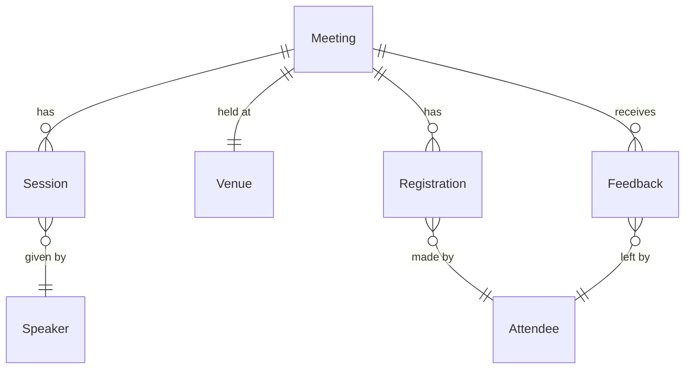

# MeetingFlow.Monolith

ASP.NET Core server-rendered monolith using Razor Pages and SQLite.

## Architecture

```
MeetingFlow.Monolith/
├── Program.cs                    # App startup, DI, middleware pipeline
├── Models/                       # EF Core entity classes (used everywhere)
│   ├── Meeting.cs                # Core aggregate — has Venue, Sessions, Registrations, Feedback
│   ├── Session.cs                # Talk/slot within a meeting, linked to a Speaker
│   ├── Speaker.cs                # Speaker profile with contact info
│   ├── Venue.cs                  # Physical location with capacity
│   ├── Registration.cs           # Attendee ↔ Meeting join with ticket/payment info
│   ├── Attendee.cs               # Person who registers
│   ├── Feedback.cs               # Post-meeting rating + comments
│   ├── Notification.cs           # Email/SMS log entry
│   └── AuditLogEntry.cs          # System audit trail
├── Data/
│   ├── MeetingFlowDbContext.cs   # EF Core context with all DbSets and relationships
│   └── SeedData.cs               # Populates demo data on first run
├── Pages/                        # Razor Pages (server-rendered UI)
│   ├── Index.cshtml              # Landing / home page
│   ├── Dashboard.cshtml          # Aggregate stats + upcoming meetings
│   ├── Meetings/
│   │   ├── Index.cshtml          # Public meeting list
│   │   └── Details.cshtml        # Single meeting with sessions, registrations, feedback
│   ├── Speakers/
│   │   └── Details.cshtml        # Speaker profile + their sessions
│   ├── Registrations/
│   │   └── Create.cshtml         # Registration form
│   ├── Admin/
│   │   ├── Meetings.cshtml       # Admin meeting list (shows InternalNotes, AdminOnlyCode)
│   │   └── AuditLog.cshtml       # Audit log viewer
│   └── Shared/
│       └── _Layout.cshtml        # Shared layout
└── wwwroot/css/                  # Static stylesheets
```

This project intentionally uses EF Core entity models directly from database queries to Razor Page views. There are no ViewModels, DTOs, or mapping layers.

### Tech Stack

- **ASP.NET Core 9** — Razor Pages
- **EF Core** — SQLite provider
- **No authentication / authorization**

## Domain Model



**Key entity fields:**

- `Meeting` — Title, Description, Status, StartsAt/EndsAt, InternalNotes, AdminOnlyCode
- `Registration` — TicketType, PaymentStatus, InternalPaymentReference
- `Speaker` — FullName, Bio, Email, Phone, InternalNotes

## Main Flows

### 1. Browse Meetings (Public)

`Pages/Meetings/Index` → queries `Meetings` with `Include(Venue)` → renders list sorted by date.

### 2. View Meeting Details

`Pages/Meetings/Details` → loads a single `Meeting` with eager-loaded Venue, Sessions → Speakers, Registrations, and Feedback → Attendees. The full entity graph is available to the view.

### 3. Create Registration

`Pages/Registrations/Create` → `OnGet` loads available meetings and attendees for dropdowns → `OnPost` binds directly to the `Registration` entity, sets `Id`, `RegisteredAt`, `PaymentStatus`, then saves.

### 4. Dashboard

`Pages/Dashboard` → runs aggregate queries (count meetings, registrations, speakers; average feedback rating) → loads upcoming published meetings with Venue and Registrations for the "upcoming" panel.

### 5. Speaker Profile

`Pages/Speakers/Details` → loads a `Speaker` with their `Sessions` list.

### 6. Admin: Meeting Management

`Pages/Admin/Meetings` → loads all meetings with Venue and Registrations, ordered by creation date. Displays internal fields (InternalNotes, AdminOnlyCode).

### 7. Admin: Audit Log

`Pages/Admin/AuditLog` → loads all `AuditLogEntry` records ordered by date descending.

### 8. Kosher Checker

`Pages/KosherCheck` accepts 1–10 dish descriptions and sends the complete batch to the configured AI provider in one non-streaming request. The provider is required to return a JSON-schema-based structured result with one of these statuses for each dish:

- `KOSHER`
- `NOT_KOSHER`
- `CONDITIONAL`
- `INVALID_INPUT`

The page keeps the last 20 successful checks in browser `localStorage`. No dish history is written to the server database.
The endpoint allows 10 checks per minute per client address and no more than 4 concurrent AI calls in one application instance.

## Running

```bash
dotnet restore
dotnet run
```

The SQLite database (`meetingflow_monolith.db`) is created and seeded automatically on startup.

The monolith starts without AI configuration, but the Kosher Checker will show an unavailable message until you create `MeetingFlow.Monolith/appsettings.Local.json`:

```json
{
  "AiChat": {
    "Model": "gpt-5-mini",
    "Endpoint": "https://api.openai.com/v1",
    "ApiKey": "your-api-key"
  }
}
```

The configured model and endpoint must support native JSON-schema structured output. The default uses OpenAI `gpt-5-mini`. `appsettings.Local.json` is ignored by Git and must not be committed.

Run the server tests:

```bash
dotnet test ../MeetingFlow.Monolith.Tests/MeetingFlow.Monolith.Tests.csproj
```

Run the browser-logic tests:

```bash
node --test ../MeetingFlow.Monolith.Tests/Browser/kosher-check.test.mjs
```

## What's Intentionally Wrong

- Razor Pages bind directly to EF Core entities
- Internal fields (InternalNotes, AdminOnlyCode) are available in all views
- The Registration create page binds directly to the entity model (over-posting risk)
- No separation between public and admin data shapes
- Dashboard loads full Meeting entities when it only needs a few fields
